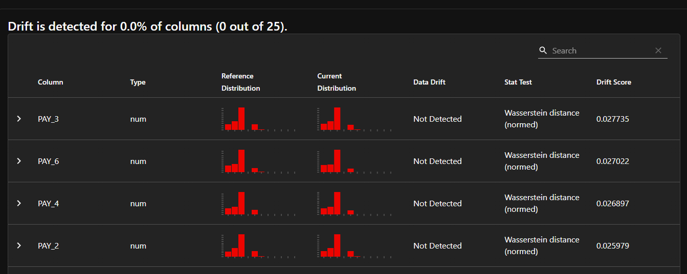
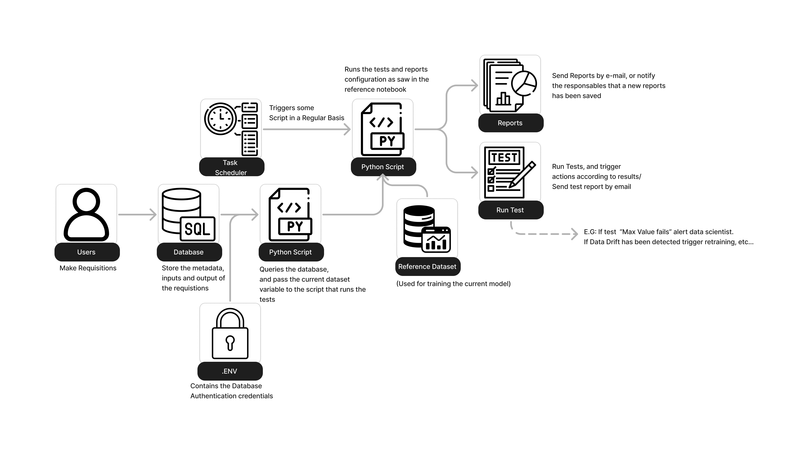

# Overview

This project contains an explanation of concepts for data and model monitoring, as well as hands-on implementation with the `Evidently AI` library. All this information is within the `project.ipynb` file.

I created reports and tests, that are avaiable in the artifacts folder:

Report example:



Finally, are provided guidelines to an automatic data and model monitoring framework for real-world applications, following this workflow design:



# Running on Your Computer

1. Clone this repository by using:

```bash
git clone https://github.com/AlisonZa/model-monitoring
```

2. Create a Python 3.10.16 virtual environment;

3. Activate this environment;

4. Install the requirements by running: 

```bash
pip install -r requirements.txt
```